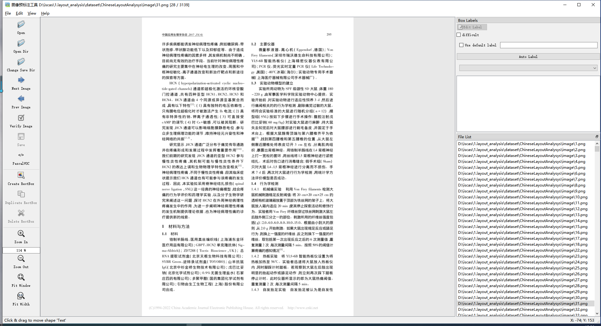
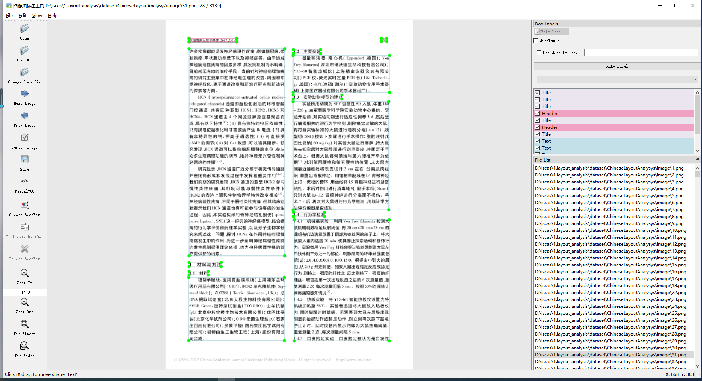

# ISCAS-CLAD  

ISCAS-CLAD is a small dataset of Chinese DLA dataset, of which the layout is annotated with both bounding boxes.
The source of the file is an open-source PDF document on the internet. The annotation was generated through pre-labeling and manual correction.

classes:

|Text|Title|Figure|Table|Header|Footer|Reference|Equation|

The dataset contains a total of 3000 training images and 600 validation images. Each image is associated with a txt and an xml file.

## Headlines

`18/April/2022` - released ISCAS-CLAD

## Getting data
Several sample examples and annotation examples are currently provided, and the dataset will be updated continuously in the future.

## Annotation format
We added pre-labeling function based on LabelImg. Firstly, the model pre-labels the Bbox with tags, then human correction is applied to the pre-labeled Bbox.
Here we provide label files in two formats, YOLO and VOC.

### Tool Display

### Display a complete annotation example:


#### YOLO
```
1 0.565436 0.758907 0.100671 0.014252
1 0.566275 0.631829 0.098993 0.014252
0 0.289430 0.648456 0.387584 0.142518
0 0.708893 0.695368 0.384228 0.086698
6 0.287752 0.859857 0.390940 0.064133
4 0.661913 0.044537 0.454698 0.013064
4 0.113255 0.045131 0.021812 0.009501
0 0.498322 0.229810 0.741611 0.115202
0 0.710570 0.592637 0.390940 0.030879
```
#### VOC
```
<annotation>
	<folder>image</folder>
	<filename>1.png</filename>
	<path>D:\iscas\1.layout_analysis\dataset\ChineseLayoutAnalysys\image\1.png</path>
	<source>
		<database>Unknown</database>
	</source>
	<size>
		<width>596</width>
		<height>808</height>
		<depth>3</depth>
	</size>
	<segmented>0</segmented>
	<object>
		<name>Title</name>
		<pose>Unspecified</pose>
		<truncated>0</truncated>
		<difficult>0</difficult>
		<bndbox>
			<xmin>67</xmin>
			<ymin>629</ymin>
			<xmax>121</xmax>
			<ymax>643</ymax>
		</bndbox>
	</object>
	<object>
		<name>Text</name>
		<pose>Unspecified</pose>
		<truncated>0</truncated>
		<difficult>0</difficult>
		<bndbox>
			<xmin>66</xmin>
			<ymin>661</ymin>
			<xmax>532</xmax>
			<ymax>740</ymax>
		</bndbox>
	</object>
	<object>
		<name>Text</name>
		<pose>Unspecified</pose>
		<truncated>0</truncated>
		<difficult>0</difficult>
		<bndbox>
			<xmin>306</xmin>
			<ymin>338</ymin>
			<xmax>537</xmax>
			<ymax>386</ymax>
		</bndbox>
	</object>
</annotation>
```

## Cite us

Todo

## Examples


